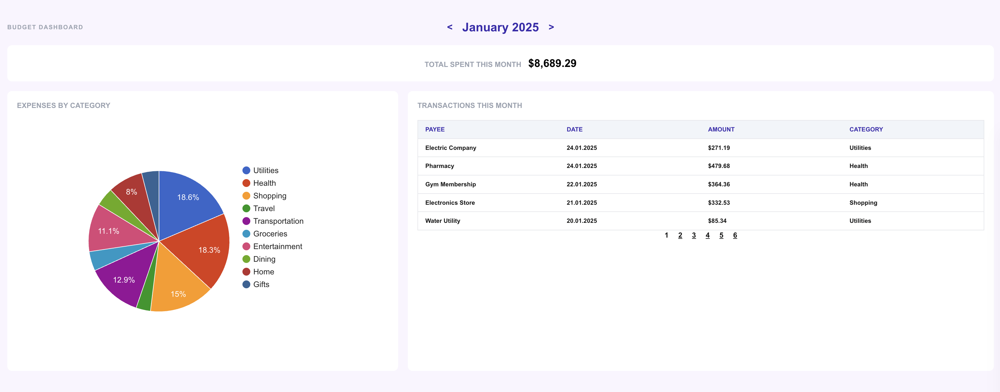

# About

This is a Budget Dashboard from [this exercise](https://reactpractice.dev/exercise/build-a-budget-app-dashboard/).

**My Goals**

- ✅ Continue strengthening my Next JS skill
- ✅ Learning "Plan First, Code later".
- ✅ Learning Tanstack Table with Pagination - This is so interesting!
- ✅ Learn to build chart using [React Google Chart](https://www.react-google-charts.com/?ref=reactpractice.dev).

**Note**

- Since I'm calling a mocked JSON file for transactions, I put it outside the component to prevent they being executed every time the component re-render.
  - But IRL, this very likely will be an API call, and needs to put inside the component - use Tanstack query for this.
- For the pagination page, since this is mocked data on the app, so we did not use server side pagination. But IRL, server side pagination is more common.

**Extra:**

- Mini project to learn [Tanstack Table](https://stackblitz.com/edit/vitejs-vite-7uu8vxzq?file=src%2FApp.tsx).
- Mini project to learn [React-Google-Chart](https://stackblitz.com/edit/vitejs-vite-bxmjcmbx?file=README.md)

**Afterthought:**

- I enjoyed doing this so much 😍 Tanstack table is awesome! Reach Google Chart was easy to use!
